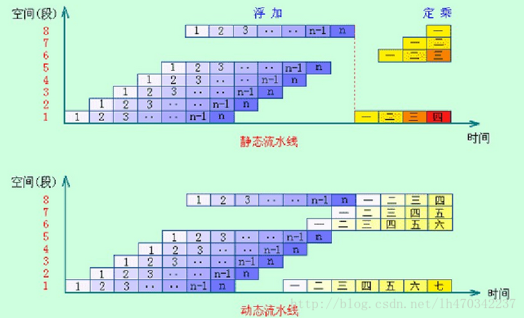

# 介绍

这里记录的是关于五级流水线的随想。

Prototype在设计的时候预计会经过单周期-五级流水线的变化，但是我们不想出现大量的接口变化，所以在设计一开始就针对五级流水线进行了思考。

# 纸上得来终觉浅

开始思考五级流水线的设计时，实际上很容易发现自己上手设计和书上介绍是非常不一样的。

## 一个周期就是一个clock？

**想多了**。

在实际设计时候，有部分stage是需要多个clock来处理的，而**固定周期静态流水线**（BJTU的CA课上学的那个）的一个周期是由最长的stage的clock数决定的，比如如果你的访存最少需要30个clock，那整个流水线的周期就是30个clock。

## 静态？动态？

流水线还有静态和动态的区别，如图：

图里认为数字的"1,2,...,n"是一个功能模块的流水线，中文的"一、二、。。。、七"是另一个功能模块的流水线。

五级流水线没分功能模块，是静态流水。

## 固定周期？不定周期？

BJTU的CA课上的流水线会默认所有阶段都要执行确定的周期长（即固定的clock），但是这是很浪费的。

举个例子，假设：Cache未命中访存需要30clock，命中需要2clock。

对于常规的五级流水线，那周期长就是30clock，也就是有Cache和没Cache没区别。

如果周期长不是固定的，可以根据运行情况调整，那么情况就会不一样：如果某一此访存命中了Cache，那么就可能节省了整个流水线28clock。

不定周期长的流水线效率自然高，但是也更难设计。对于固定周期的流水线，只要在每一个阶段设置一个计数器，计算什么时候结束周期就行；而对于不定周期流水线，需要设计复杂的反馈/控制信号。

## 关于握手信号`valid`和`ready`

我们要求：只要在某一个上升沿，`valid`和`ready`同时为true，这个上升沿数据就会被发送方发出、接受方接收。在下一个上升沿，如果`valid`仍是true，只表示下一组数据已经准备传输了；在下一个上升沿，如果`valid`和`ready`仍同时为true，只表示下一组数据将进行传输。

