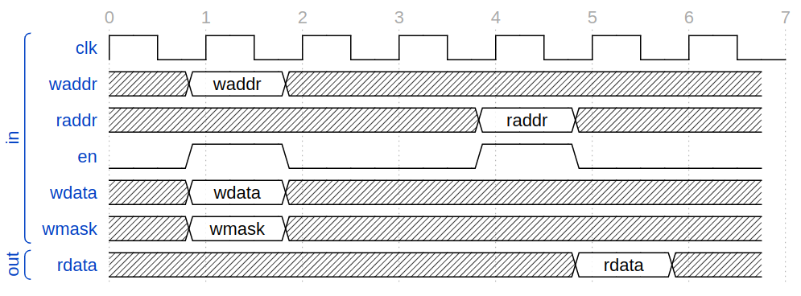

# 介绍

这个文档记录对访存代理（`MemAccessProxy`）的设计想法。


# 背景介绍

## Chisel3的memory

根据[Chisel官网对memories的介绍](https://www.chisel-lang.org/chisel3/docs/explanations/memories.html)，Chisel的`SyncReadMem`（也就是我们用的那个）时序图是这样的：



并且官网也有介绍：

1. Writes take effect on the rising clock edge after the request. Reads return data on the rising edge after the request. Read-after-write behavior (when a read and write to the same address are requested on the same cycle) is undefined.
2. If the same memory address is both written and sequentially read on the same clock edge, or if a sequential read enable is cleared, then the read data is undefined.
3. Values on the read data port are not guaranteed to be held until the next read cycle. If that is the desired behavior, external logic to hold the last read value must be added.

根据第1条，`SyncReadMem`会在**保证**存储器得到数据后的第一个上升沿给出稳定的数据，所以这里不需要握手（这也是为什么`SyncReadMem`被称为sequential/synchronous-read(同步读取)）。

第2条表示同周期读写同地址需要手动修正读到的内容为写入的，否则行为未定义。

第3条表示读的数据只保证在“得到数据后的第一个上升沿”稳定，不保证在第二个上升沿时依然稳定。**所以，如果是在第一个上升沿和第二个上升沿之间读取数据，最好用一个寄存器在第一个上升沿存下来读到的值。**


此外，`SyncReadMem`是支持多端口的，可以参考下面Chisel代码生成的Verilog来验证这一事：

```scala
import chisel3._
import chisel3.util._

object TesterApp extends App {
  class Dut extends Module {
    val io = IO(new Bundle {
      val in1  = Input(UInt(3.W))
      val in2  = Input(UInt(3.W))
      val dat1 = Input(UInt(8.W))
      val dat2 = Input(UInt(8.W))
      val en1  = Input(Bool())
      val en2  = Input(Bool())
      val out1 = Output(UInt(8.W))
      val out2 = Output(UInt(8.W))
    })
    val mem = SyncReadMem(8, UInt(8.W))
    when(io.en1) {
      mem.write(io.in1, io.dat1)
      io.out1 := 0.U
    }.otherwise {
      io.out1 := mem.read(io.in1)
    }
    when(io.en2) {
      mem.write(io.in2, io.dat2)
      io.out2 := 0.U
    }.otherwise {
      io.out2 := mem.read(io.in2)
    }
  }
  (new chisel3.stage.ChiselStage).emitVerilog(new Dut, args)
}
```


## I-Cache和D-Cache

由于指令和数据的访存区域不同、访存的性质不太一样（比如指令访存一般不会写，但是数据访存则存在大量的写操作）等等原因（更详细的可以参考[Why are separate icache and dcache needed](https://stackoverflow.com/a/8713032)），Cache会分成I-Cache和D-Cache，即指令Cache和数据Cache。

此外，两个Cache之间还有一致性问题，这个后面再讨论。


## 个人赛用的SRAM

注意几个特性：这个SRAM是1M*16bits的，我们暂时不讨论兼容性问题（比如我们会32位数据一读），只看它的时序。

比赛的SRAM的读写时序图：

读：


写：


注意SRAM不使用clock时钟，所以不像Chisel3的memory一样受“上升沿”之类的控制。

但是其实本质和Chisel的Mem差不多：读：在给了数据之后的某个时间（不再是某个上升沿）保证数据有效，过了这个时间数据就无效；写：在给了数据之后的某个时间段后才能看到改变。

此外，这个存储器还有别的时序，请参考文档。


## Cache的读写时序

根据龙芯杯各个队的报告，以及Cache原理的思考，可以得到这么一个结论：

Cache的时序和Chisel的Mem一样！

我们再看一下Chisel的Mem的时序：


其实挺好理解的：Cache实际上就是用RTL实现的一个存储区域，和`Vec`没有区别，而`Vec`的时序就是上图的时序。


# 设计随想

## 为什么要有代理

一言以蔽之：在设计初阶段和部分验证阶段，我们的访存模块和最终需要的访存模块是不太一样的，我们想在不改变大体接口设计的情况下完成整个设计。

在最后我们的访存模块肯定需要提供诸如MMU、Cache管理等功能，但是这些内容需要CPU提供非常多支持（比如CP0、异常处理等等），在设计的初期以及做部分验证的时候我们搞不太清楚这些内容及与这些内容相关的接口应该怎么实现——那就不实现，转而使用“代理”的方式，用统一的接口规定，并在一开始使用一个navie的访存模块，之后再更改成复杂的。

图示如下：

```
	|----- InstMemAccessProxyBundle ------- DataMemAccessProxyBundle -----|
	|																	  |
	|																	  |
	|							MemAccessProxy							  |
	|									|								  |
	|					----------------+------------					  |
	|					|							|					  |
	|				BareMemory			TrueMem(With MMU, Cache...)		  |
	|												|					  |
	|												------------------------- AXI4
	|																	  |
	|---------------------------------------------------------------------|
```

需要注意的是，最终的Memory很可能是需要通过诸如AXI4之类的方式连接的外部存储，而不是内部存储，但是从CPU内部其他部件的角度来说，只要`InstMemAccessProxyBundle`和`DataMemAccessProxyBundle`两个接口和接口相关的时序不变，那么整体设计就不需要变。


## 为什么两个代理接入口

因为有I-Cache和D-Cache，它们很可能需要分开处理。


## 为什么数据以word为单位

一次写入和读出都是一个word，同时也注意：实际上可以通过增加mask来选择一个word中哪几个byte要写入。


# 时序设计介绍

## 一些不可行的想法

* 为什么不根据存储器`wdata`的变化做设计呢？

  因为`wdata`有可能根本不变化。


## 设计

由于：

* Cache的时序和Chisel的Mem时序一样。
* 龙芯杯个人赛的存储器和Chisel的`SyncReadMem`都是采用类似的时序。

所以我们设计了这么一种时序：

* 对于读：在某一个上升沿传递地址和使能信号，

  * 如果Cache命中，那么在之后的第1个上升沿，就可以得到稳定的数据，和Cache命中的信号。
  * 如果Cache未命中，在之后的第`rdWaitingStepsNum`个上升沿，可以得到稳定的数据。

  无论是否命中，在得到稳定数据的那个上升沿之后的第一个上升沿数据就不再稳定。

* 对于写：在某一个上升沿传递地址、数据和使能信号，

  * 如果Cache命中，那么在当上升沿，数据就会写入，并且输出Cache命中信号直到输入的地址更改。
  * 如果Cache未命中，在之后的第`wrWaitingStepsNum`的个上升沿才能确保写入成功。

对于Bare Mem来说，**我们假设每一次都命中了Cache**。

